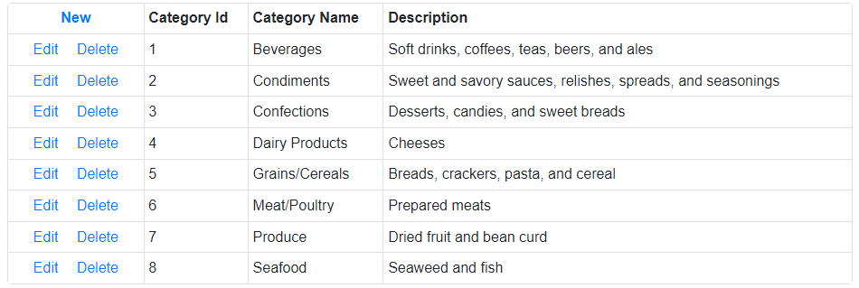

<!-- default badges list -->

<!-- default badges end -->

# DataGrid for Blazor - How to bind the Web API Service

You can use the HttpClient to obtain data from the remote service. Save data to a collection and bind the Data Grid to it.

The example solution contains two projects:

* **MyTestWebService**: This sample project implements a Web API with ASP.NET Core. Restore the backup on your SQL server and change the connection string in [NWINDContext.cs file](./CS/MyTestWebService/MyTestWebService/Models/NWINDContext.cs#L21) (see the *OnConfiguring* method). 

* **DataGridWithWebApiService**: This project uses the connection to the **MyTestWebService** web service. Deploy the **MyTestWebService** project, start it, and specify its address in the `Path` [variable](./CS/DataGridWithWebApiService/DataGridWithWebApiService/Data/WebServicePath.cs#L3):
    
    

<!-- default file list -->
## Files to Look At

* [Index.razor](./CS/DataGridWithWebApiService/DataGridWithWebApiService/Pages/Index.razor)
* [Model.cs](./CS/DataGridWithWebApiService/DataGridWithWebApiService/Data/Model.cs)
* [WebServicePath.cs](./CS/DataGridWithWebApiService/DataGridWithWebApiService/Data/WebServicePath.cs)
* [CategoriesController.cs](./CS/MyTestWebService/MyTestWebService/Controllers/CategoriesController.cs)
* [NWINDContext.cs](./CS/MyTestWebService/MyTestWebService/Models/NWINDContext.cs)
* [Categories.cs](./CS/MyTestWebService/MyTestWebService/Models/Categories.cs)
<!-- default file list end -->

## Documentation

* [Data Grid: Data Binding](http://docs.devexpress.devx/Blazor/DevExpress.Blazor.DxDataGrid-1.Data)

* [Data Grid: Bind to Data with EF Core](https://docs.devexpress.com/Blazor/403167/common-concepts/bind-data-grid-to-data-from-entity-framework-core)

## More Examples

[Data Grid - How to use DevExpress Reporting tools to implement export in a WASM application ](https://github.com/DevExpress-Examples/blazor-webassembly-dxdatagrid-export)
