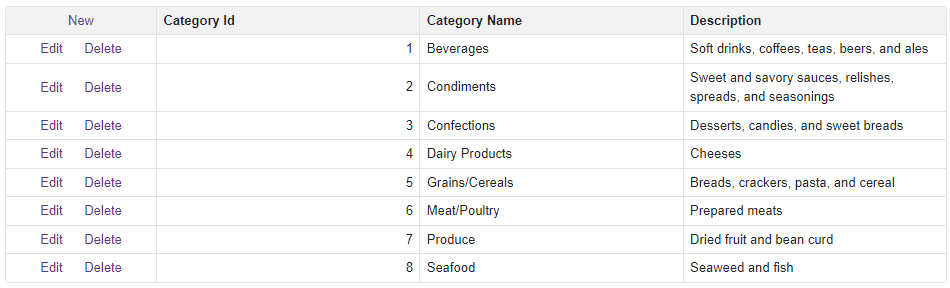

<!-- default badges list -->

<!-- default badges end -->

# Grid for Blazor - How to bind the Grid to a Web API service

You can use the HttpClient to obtain data from the remote service. Save data to a collection and bind the Grid to it.

## Quick Start

The **DataGridWithWebApiService** application should connect to the same port that the **MyTestWebService** application uses. Start the **MyTestWebService** application, copy the port number from the URL, and paste the clipboard content to the `Path` [variable](./CS/DataGridWithWebApiService/DataGridWithWebApiService/Data/WebServicePath.cs#L3):

<!-- default file list -->
## Files to Review

* [Index.razor](./CS/DataGridWithWebApiService/DataGridWithWebApiService/Pages/Index.razor)
* [Model.cs](./CS/DataGridWithWebApiService/DataGridWithWebApiService/Data/Model.cs)
* [WebServicePath.cs](./CS/DataGridWithWebApiService/DataGridWithWebApiService/Data/WebServicePath.cs)
* [CategoriesController.cs](./CS/MyTestWebService/MyTestWebService/Controllers/CategoriesController.cs)
* [NWINDContext.cs](./CS/MyTestWebService/MyTestWebService/Models/NWINDContext.cs)
* [Categories.cs](./CS/MyTestWebService/MyTestWebService/Models/Categories.cs)
<!-- default file list end -->

## Documentation

* [Grid: Data Binding](https://docs.devexpress.com/Blazor/403737/grid/bind-to-data)
* [Bind Components to Data with Entity Framework Core](https://docs.devexpress.com/Blazor/403167/common-concepts/bind-data-grid-to-data-from-entity-framework-core)
